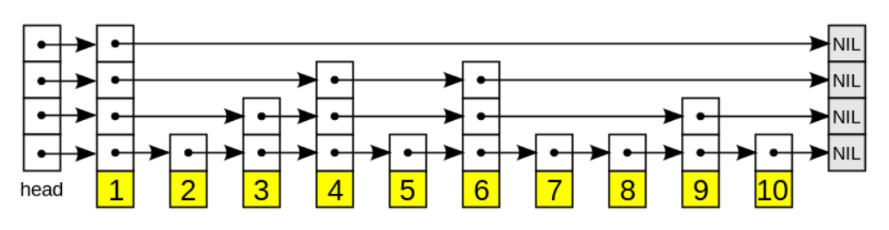
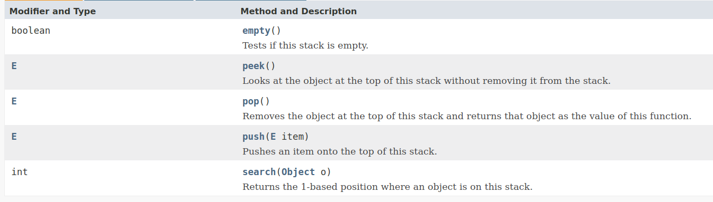
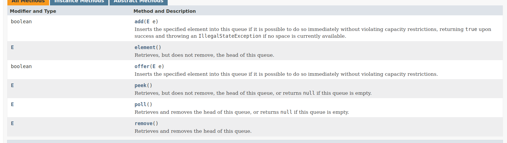

# 算法训练营第一周笔记

## 训练准备和时间复杂度分析

- #### 前序 **preOrder**

  > root -> left -> right
  >
  > ```java
  >  void preOder(TreeNode<String> treeNode) {
  > 		if (treeNode == null) return;
  > 		System.out.print(treeNode.data);
  > 		preOder(treeNode.left);
  > 		preOder(treeNode.right);
  > 	}
  > ```
  >
  > 时间复杂度为O(n)

- #### 中序 **inOrder**

  > ​	left -> root -> right
  >
  > ```java
  >  void inOrder(TreeNode<String> root) {
  > 		if (root == null) return;
  > 		inOrder(root.left);
  > 		System.out.print(root.data);
  > 		inOrder(root.right);
  > 	}
  > ```
  >
  > 时间复杂度为O(n)

- #### 后序 **postOrder**

  > ​	left -> right -> root
  >
  > ```java
  > void postOrder(TreeNode<String> root) {
  > 		if (root == null) return;
  > 		postOrder(root.left);
  > 		postOrder(root.right);
  > 		System.out.print(root.data);
  > 	}
  > ```
  >
  > 时间复杂度为O(n)

- #### 图的遍历

  > **BFS(Breadth First Search)**，广度优先， 按层次依次遍历。时间复杂度为O(n)；
  >
  > **DFS(Deepth First Search)**，深度优先， 从单一节点深度依次遍历。时间复杂度为O(n)；

- #### 二分查找 **BinarySearch**

  > ```java
  > int bs(int[] a, int low, int high, int key) {
  >    if (low > high) return -1;
  >    int mid = (low + high) >>> 1;
  >    if (a[mid] == key) return mid;
  >    if (a[mid] > key) {
  >       return bs(a, low, mid - 1, key);
  >    } else {
  >       return bs(a, mid + 1, high, key);
  >    }
  > }
  > ```
  >
  > 每次只需要折半，所以时间复杂度为O(n)

## 数组，链表，跳表

### 数组

 	数组是在内存中连续的一段空间

**特点**:

1. **可以根据下标直接定位到数组元素**
2. CPU在读取数组的时候，可以缓存当前内存位置左右的数据，所以在预热后读取效率很高
3. 申请空间时，需要指定空间大小，内存如果不足**整个数组**会创建失败

**所以**

1. （查找）根据下标的定位O(1)
2. 如果需要**保证原来的顺序**，而进行**增加**和**删除**，平均时间复杂度为：O(n/2)

### 链表

链表，没有限制其在内存中的分布，通常在内存中的不是连续的

**特点**：

1. 定位元素只能通过节点的关系依次查找
2. 申请空间时，不需要指定空间大小，内存如果不足**只有最近创建的节点**会创建失败

**所以**：

1. 查找的平均时间复杂度为O(n/2)
2. 删除和新增的时间复杂度为O(1)

> 注意：删除和新增，如果是建立在需要先查询，再操作的话，时间复杂度就是 O(n) + O(1)，也就是O(n)

## 跳表

### **概念**

> - 跳表是一种**随机化**的数据结构。这种结构，基于**有序链表**。
>
> - 跳表通过概率，创建子链表。
>
> - 子链表是基于原始链表，它拥有更少的元素，并且不会包含原始链表之外的元素。
>
> - 将其假设为地铁的话，它就是一列**快速列车**，它不会在每个站停靠。假设你知道你的目的地，快速列车是更好的选择。
>
> - 跳表中**有多个链表**，每个链表都不会存储真实的数据，链表每个元素维护指向真实数据的指针，而每个链表之间的关系是**层级关系**，如下图：
>
> 

### **特点**

跳表更能适应并发的访问，它不像其它的**平衡二叉树**，并发访问时需要锁住很多节点(为了保持平衡)。

这种情况，跳表只会影响它的节点附近的节点，大部分节点是不受影响的。

### **随机性**

1. 假设一个随机数p，1 > p > 0
2. 最底层链表（第n层）：所有元素 + head + tail(nil/null)
3. n - 1 层链表： 所有元素个数 * p + tail(nil/null) 

### **增删改步骤**

步骤如下图，如图可见，在增加元素的时候，每一层链表，都会通过随机数`p`计算概率，如果通过，则在上层链表增加对元素的索引。


## 如何实现一个LRU

这个问题的描述来自[leecode-146-LRU缓存机制](https://leetcode-cn.com/problems/lru-cache/)

### 一个**LRU**需要的条件

- API：获取数据 `get` 和 写入数据 `put`
- 获取数据 `get(key)` ，如果关键字 (key) 存在于缓存中，则获取关键字的值（总是正数），否则返回 -1
- 写入数据 put(key, value) 
  - 如果关键字已经存在，则变更其数据值
  - 如果关键字不存在，则插入该组{key,value}
  - 当缓存容量达到上限时，它应该在写入新数据之前删除最久未使用的数据值，从而为新的数据值留出空间

### 从需求中得出

- 需要一个map，作为key-value的映射
- 需要一个动态数组或链表，存储value，并记录缓存信息

也就是说，这需要两个数据结构来维护，有两种方案：

1. value信息交给一个数组来维护 -- **方案一**
2. value信息交给一个链表来维护 -- **方案二**

### 比较两个方案

两种方案都需要一种数据结构，维护着{key,value}，如下：

```java
class Node{
	int key;
	int value;
}
```

目的是**提供通过value定位到key的方法**

#### **方案一**实现细节

1. map维护key和数组下标，数组下标指向value，每次数组更新时，要调整map的value
2. get的时候
   - 假如get的位置是 `i`，数组长度是`n`
   - 把数组`(0 -> i-1)`个位置，往后移
   - 第`i`个位置，移动到第`0`位（数组头）
   - 更新map中的value
3. put的时候
   - 取出数组尾的value
   - 通过该`value`定位到map中的key
   - 移除数组中这个value，移除map中这个key
   - 数组所有元素后移一位，并更新map中的value
   - map直接put，put的value放到数组头

#### **方案二**实现细节

使用链表选择使用双向链表

> 因为在put的时候，假如超过size，则会头节点添加，并且删除尾节点
>
> 单向链表需要遍历，才能分别找到头节点和尾节点，put的操作是O(n)的
>
> 
>
> 双向链表，只需要加上`headDummy`和`tailDummy`
>
> `headDummy`的`nextNode`是真正的头节点`tailDummy`的`preNode`是真正的尾节点
>
> 所以双向链表的put是O(1)的

1. map维护key和链表指向value的索引（node实例，但是这个node有pre和next指针）
2. get的时候
   1. 把当前node移动到链表的头部（或尾部）
3. put的时候（如果超过size）
   1. 把put的元素放到双向链表的头部（或尾部）
   2. 定位到链表的尾部（或头部）
   3. 移除双向链表的元素，并移除map该key的元素

#### 总结

可以看出，方案一put和get都有可能是**O(n)的时间复杂度**，方案二都是**O(1)的时间复杂度**

## LinkedHashMap说明

[官方文档介绍](https://docs.oracle.com/javase/8/docs/api/java/util/LinkedHashMap.html)

### `LinkedHashMap`和`hashmap`比较

- `LinkedHashMap`是`hashmap`的有序实现

- `hashmap`是按照hash来排序的，所以它的内部存储可以看作是无序的

- `LinkedHashMap`排序有两种方式，一种是 *insertion-order*，一种是*access-order*
- `LinkedHashMap`通过构造函数，指定使用的`order ruler`

### `LinkedHashMap`使用规则

**内部访问（*entry access*）**

- 如果是`putAll`方法的话，会按照`map`里`keySet`的`iterator`遍历方式进行排序
- `LinkedHashMap`只有在`putAll`的时候会有*entry access*
- 非*entry access*的时候，都会按照put和get的顺序重新排序
- 简单来说，对开发者而言，*entry access*不可控，其余方式都可控
- 当新元素加入的时候`removeEldestEntry`方法决定了移除规则，可以覆盖此方法，定义自己的规则

### `LinkedHashMap`排序规则

**规则定义**

- 如果要自定义排序规则，应该覆盖`removeEldestEntry(Map.Entry)`方法

- 该方法会返回`boolean`变量，通过`true`或`false`决定是否要重新排序

**为什么是这样的规则**

- `hashmap`在定义的时候，指定了这样一些回调方法，这些方法在`hashmap`中都是空实现

  ```java
      // Callbacks to allow LinkedHashMap post-actions
  /** 在节点被访问的时候被回调，注意：hashmap的get方法没有回调，
    	LinkedHashMap中，假如指定了access-order，它会被回调
    	常规的回调地方，在put操作中*/
  	void afterNodeAccess(Node<K,V> p) { }
  /** 在hashmap发生insert操作的时候（evict默认指定为true）被回调  */
      void afterNodeInsertion(boolean evict) { }
  /** 在删除节点操作的时候被回调  */
      void afterNodeRemoval(Node<K,V> p) { }
  ```

  这些方法都是**包内公开**的方法，也就是说，不允许被覆盖的方法

  为了让篇幅更少，对源码做了一些调整，下面是这些源码

  `afterNodeAccess`方法（源码305行），把新访问的节点放在双向链表的尾部

  ```java
  void afterNodeAccess(Node<K,V> e) { // move node to last
          LinkedHashMap.Entry<K,V> last;
          if (accessOrder && (last = tail) != e) {
              LinkedHashMap.Entry<K,V> p = e, b = p.before, a = p.after;
              p.after = null;
              if (b == null) head = a;
              else b.after = a;
              if (a != null) a.before = b;
              else last = b;
              if (last == null) head = p;
              else {
                  p.before = last;
                  last.after = p;
              }
              tail = p;
              ++modCount;
          }
      }
  ```

  `afterNodeInsertion`方法（源码297行），如果`removeEldestEntry`方法返回`true`，就移除头节点

  ```java
      void afterNodeInsertion(boolean evict) { // possibly remove eldest
          LinkedHashMap.Entry<K,V> first;
          if (evict && (first = head) != null && removeEldestEntry(first)) {
              K key = first.key;
              removeNode(hash(key), key, null, false, true);
          }
      }
  ```

  `afterNodeRemoval`方法（源码283行），移除当前节点

  ```java
  void afterNodeRemoval(Node<K,V> e) { // unlink
          LinkedHashMap.Entry<K,V> p = e, b = p.before, a = p.after;
          p.before = p.after = null;
          if (b == null)	head = a;
          else	b.after = a;
          if (a == null)	tail = b;
          else	a.before = b;
      }
  ```

  这里可以看出，`LinkedHashMap`的`LRU`是往双向链表尾添加节点，移除节点是在头部

  `removeEldestEntry`方法只能决定`map`在执行了新增操作之后，是否要移除头节点，覆盖`removeEldestEntry`方法，则是决定移除头节点的时机

  

## 栈、队列、双端队列、优先队列

栈，队列这样的数据结构，主要提供写操作

### 栈

**特点**：后入先出 **Last In First Out**

> 通常，入栈的方法是 **push()**，出栈的方法是**pop()和peek()**

- JDK8中`Stack#peek()`源码

  ```java
  public synchronized E peek() {
          int     len = size();
  
          if (len == 0)
              throw new EmptyStackException();
          return elementAt(len - 1);
      } 
  ```

  如代码所示，会把当前栈中，栈顶元素取出来返回

- JDK8中`Stack#pop()`源码

  ```java
   public synchronized E pop() {
          E       obj;
          int     len = size();
  
          obj = peek();
          removeElementAt(len - 1);
  
          return obj;
      }
  ```

  如代码所示，会取出栈顶元素返回，并将其从栈中移除

- JDK8中`Stack#push()`源码

  ```java
   public E push(E item) {
          addElement(item);
          return item;
      }
      
      public synchronized void addElement(E obj) {
          modCount++;
          ensureCapacityHelper(elementCount + 1);
          elementData[elementCount++] = obj;
      }
  ```

  如代码所示，只是往栈中添加元素

在java中，`Stack`类作为栈的标准实现，提供的接口如下图展示：



它的实现方式也很简单，创建一个数组，数组的**读写只能从尾端操作**

### 队列

**特点**：先入先出 **First In First Out**，按照入队顺序出队。

在java中，`Queue`作为队列的顶级接口，定义了队列的操作方式，接口如下：




```javascript
// 位运算的妙用
// 1. 计算一个数的二进制形式 1 的位数
// eg:. 比如： 127 ≈ `01111111` 有 7 个 `1`
func cntOneBitInNum(num int) (cnt uint8) {
   for num > 0 {
      num = num & (num - 1)
      cnt++
   }
   return
}

// 2.计算一个数二进制形式的最低位为 1 的值
// eg:. 比如： `1000` 值为 1000， `0100` 值为 `100`,  `0001` 值为 `1`
func lowBitIsOneNum(num int) (cnt int) {
   return num & (-num)
}

// 3.判断一个数是否是奇数
func isOdd(num int) (cnt bool) {
   return num&(0x1) == 0x1
}

// 4.二进制加法
// eg:. 这里的实现是： （a & b） << 1  表示有进位， a ^ b 计算和， 但是不能计算进位
func bitCarry(a, b int) (ans int) {
   var carry int = (a & b) << 1
   ans = a ^ b
   a = ans
   b = carry
   for ; carry > 0; {
      ans = a ^ b
      carry = (a & b) << 1
      a = ans
      b = carry
   }
   return
}

// 5. 求集合 left 与 集合 right 的交集 (left 和 right 都是小写字母)
func and(left, right []byte) (ans []byte) {
   var hash uint32
   const _a byte = 'a'
   // 求出 left 集合的 hash 值
   for _, v := range left {
      hash |= uint32(1 << (v - _a))
   }
   
   for _, v := range right {
      h := uint32(1 << (v - _a))
      // 拿当前的值和 hash 进行与操作, 如果相等, 表示 相同的元素
      if (hash & h) == h {
         ans = append(ans, v)
      }
   }
   return
}

// 6. 求集合 left 与 集合 right 的并集 (left 和 right 都是小写字母)
func or(left, right []byte) (ans []byte) {
   var hash uint32
   const _a byte = 'a'
   // 求出 left 集合的 hash 值
   for _, v := range left {
      hash |= uint32(1 << (v - _a))
   }
   
   for _, v := range right {
      hash |= uint32(1 << (v - _a))
   }
   
   const _sz = 26
   for i := byte(0); i < _sz; i++ {
      h := uint32(1 << (i))
      if ((hash & h) == h) && (h != 0) {
         ans = append(ans, i+_a)
      }
   }
   
   return
}

// 7. 快速幂问题
// 计算 (a ^ b) % p 的问题
func quickPow(a int64, b int64, p int64) (ans int64) {
   ans = 1 % p
   for b > 0 {
      if b&1 > 0 {
         ans = ans * a % p
      }
      a = a * a % p
      b = b >> 1
   }
   return ans
}
```