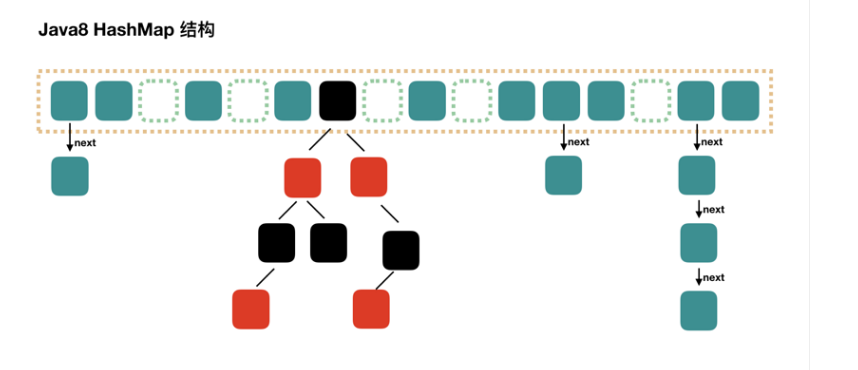

# 算法训练营第二周笔记

## `HashMap`总结

基于java的**语言特性**，以及java对`hashmap`的**数据结构的实现**来描述

### java语言层

#### java中map的基本概念

- ` hashmap`是`Map`接口中基于**hash表**这种**数据结构**的实现

- `Map`接口提供了对*key-value*结构的数据的访问和存储功能
  - 包括`put`、`get`、`remove`、`clear`、`isEmpty`和对`entrySet`操作的*api*
- `Map`接口的通用实现中，主要有`SortedMap`、`NavigableMap`和`hashmap`
  - `SortedMap`是`NavigableMap`的子集，`SortedMap`提供了通过`Comparable`或`Comparator`对*key*排序的功能
  - `NavigableMap`除了`SortedMap`提供的功能，还具备导航的功能，比如`lowerEntry(K)`,`floorEntry(K)`, `ceilingEntry(K)`, 和 `higherEntry(K)`，这些*api*可以获取到**原map**的**子map**
- ` hashmap`是`Map`接口中的一个实现，基于**hash表**的意思是，***key*的存储和定位方式**，是通过**hash算法**来实现的
  - java中，hashmap有两个标准实现，一个是`HashMap`类，一个是`LinkedeHashMap`类
  - 两者对**key的存储和定位**都是基于hash算法实现的
  - `LinkedeHashMap`只是value是有序的，可以按照**插入顺序排序**，也可以按照**访问顺序排序**
  - `HashMap`可以说是无序的，并且也不会保证*value*的顺序不变（***value*顺序可变且不受控制**）

#### `HashMap`整体结构

核心的内部类

- Node

  > 源码中介绍如下：Basic hash bin node, used for most entries. 
  >
  > 它定义的属性有： **hash、 key、 value、 next**。
  >
  > 这几个属性包含了一个节点所需要的所有必要信息，也表明了它是一个链表结构

- `KeySet`、`Values`和`EntrySet`

  > 这三个内部类主要是为了实现`Map`接口定义的方法
  >
  > ```java
  > Collection<V> values();
  > Set<K> keySet();
  > Set<Map.Entry<K,V>> entrySet()；
  > ```

- 还有各种`Iterator`和各种`Spliterator`

  > `Iterator`提供了java语言支持的集合遍历方式
  >
  > `Spliterator`是jdk8才提供的，目的是使用`stramAPI`的时候方便内部分割

- TreeNode

  > `TreeNode`的作用和`Node`的作用是一样的，不过它是红黑树结构
  >
  > 当hashmap中hash碰撞的元素超过8个之后，`Node`会升级为`TreeNode`

## java对hash表的实现

### 总述

java中`hashmap`是由一个数组来实现的，不同的key，通过hash算法，计算出来的hash值作为数组下标。图如下：

### 初始化

- 创建一个`hashmap`对象，创建时，给`loadFactor`赋值

  > 注意：如果指定了`initialCapacity`，只会给`threshold`赋值
  >
  > `hashmap`不会在初始化对象的时候初始化数组

- put元素，put内部调用了

  ```java
  V putVal(int hash, K key, V value, boolean onlyIfAbsent, boolean evict)
  ```

  1. **hash参数**，通过hash算法计算的，计算规则如下：

  ```java
  (key == null) ? 0 : (h = key.hashCode()) ^ (h >>> 16)
  ```

  ​	java会为每个实例对象分配一个`hashCode`

  - JVM在实例化完成之后，就把为这个对象分配的`hashCode`放到了这个对象的**对象头**中

  - JVM的hash算法中，区分度最大的地方主要在`hashCode`的**前16位**（所以hashcode只取前十六位数字）

  2. **`onlyIfAbsent`参数**

     - 如果为`true`: 新的value不会覆盖旧值，被封装到了`putIfAbsent(key, value)`方法中
     - 如果为`false`：新的`value`覆盖旧值，被封装到了`put(key, value)`方法中

  3. **evict参数**

     >  提供`afterNodeInsertion(evict)`是否回调的判断
     >
     > hashmap中没有用到,其子类`LinkedHashMap`使用了该回调

- 通过两个核心参数（`threshold`、`loadFactor`），校验hash是否需要扩容以及操作是否合法

  - 如果数组为空，需要resize

    > 第一次put的时候满足这点，上面也说了，数组没有被初始化
    >
    > `threshold`会被特殊处理，保证`threshold`必须是2的n次方
    >
    > ```java
    > int tableSizeFor(int cap) {  // 或运算，把0改成1
    >     int n = cap - 1; // 避免cap = 2^m
    >     n |= n >>> 1;  	  // 最高位的前2位改成 1
    >     n |= n >>> 2;  	  // 最高位的前4位改成 1
    >     n |= n >>> 4;  	  // 最高位的前8位改成 1
    >     n |= n >>> 8;  	  // 最高位的前16位改成 1
    >     n |= n >>> 16;   // 最高位的前32位改成 1
    >     // MAXIMUM_CAPACITY = 1 << 30 ，n现在全部都是1，n+1 就等于 2^m
    >     return (n < 0) ? 1 : (n >= MAXIMUM_CAPACITY) ? MAXIMUM_CAPACITY : n + 1;
    > }
    > ```

  - 如果没有`threshold`： 数组默认长度*1 << 4（16）*，`loadFactor`默认为*0.75*；`threshold`赋值（16 * 0.75），创建长度为16的数组

  - 如果有`threshold`： 数组长度等于指定的`threshold`，`threshold`再重新计算 `length` * `loadFactor`

  - 完成初始化，开始put第一个值

### put

**`Hashmap`的hash算法**：index = `(tab.length - 1) & hash`

>  该算法保证了自己的hash值被分配到`tab.length - 1`中

**`Hashmap`中的hash碰撞**：在数组的index位置上，如果没有元素，则没发生hash碰撞，否则发生hash碰撞

- 没发生hash碰撞，直接把`Node`实例对象放到该位置上

- 发生了hash碰撞

  - 如果`Node`已经升级为`TreeNode`，往`TreeNode`中添加元素

  - 如果`Node`没有升级为`TreeNode`，`Node#next()`计算链表长度

    - 如果`Node`长度超过8，并且数组长度小于64，则resize

      > 数组长度小于64的时候，没有必要升级为红黑树，优先考虑让数组扩容一下，保证hash函数的定位足够准确

    - 如果`Node`长度超过8，并且数组长度大于64，升级为`TreeNode（红黑树）`，并添加元素

    - 如果`Node`长度没超过8，往`Node(链表)`后添加元素

- 如果当前`hashmap`的size大于`threshold`，执行`resize`，否则返回

  `resize`主要讲rehash的策略，resize之前的数组称它为**oldTab**，新的称为**newTab**

  - 遍历**oldTab**，**oldTab**中元素称为`node`,位置为`index`

  - 如果node没有退化为链表（`node.next == null`）,**newTab**的index位置，直接拷贝

  - 如果node退化成红黑树，执行`TreeNode#split`方法

    - 该方法把红黑树退化成两个链表或者两个树，也或者一个树一个链表

    - 分配的规则和链表重新分配的规则类似，详情可见链表重新分配的描述

    - 一个位置在index上，另一个位置在 `index + oldTab.length`上

      > `index + oldTab.length`不会越界，因为每次扩容都是扩一倍

  - 如果node是一个链表

    - 链表的节点被分为了`head(头)`和`tail(尾)`，`head`和`tail`又分为了`hight(高位)`和`low(低位)`

    - 高位和低位的区别是，`hash & oldTab.length`是否等于0，等于0的是低位

      > 因为数组扩容了，`hash & oldTab.length`等于0则不会分配到新数组中
      >
      > 扩容之前，没有被分配到数组0位置，是因为那时位置在``hash & (oldTab.length - 1)`上

    - 低位的元素就放在新数组的index位置上

    - 高位的元素就放在新数组`index + oldTab.length`位置上

      > 这样的话，只能保证当前位置上的链表分成了两个链表，并不能保证每个元素能分配一个位置
      >
      > 这是必须的，毕竟`resize`的时候只扩容了一倍
      >
      > 这个分配规则和红黑树分配规则类似，不过红黑树有一个`unTreefy`的过程，比较麻烦

#### 注意：在put的时候，resize()的时机

- 如果是put的第一个元素

  > 这时resize()的目的是初始化

- 如果需要退化成红黑树，有可能会resize()

  > 这时的目的是让hashmap扩容而不是退化成红黑树，如果扩容让数组长度超过了64，就不得不退化成红黑树

- put元素结束后，也有可能会resize()

  > 这时候如果超过了阈值，就会resize()

#### 注意：resize()的时候，发生并发问题

下面`resiz()`的时候，更新链表数据的源代码。

```java
 do {
    next = e.next;
    if ((e.hash & oldCap) == 0) {
        if (loTail == null)		loHead = e;
        else 	loTail.next = e;
        loTail = e;
  	 } else {
         if (hiTail == null)	hiHead = e;
         else	hiTail.next = e;
         hiTail = e;
  	}
 } while ((e = next) != null);
```

可以看出，**往新链表中添加数据**的时候，都是在新链表的**Tail后面添加数据**。

在JDK7的时候，是往新链表的头添加数据。源码如下：

```java
 void transfer(Entry[] newTable, boolean rehash) {
        int newCapacity = newTable.length;
        for (Entry<K,V> e : table) {
            while(null != e) {
                Entry<K,V> next = e.next;
                if (rehash) { 
                    e.hash = null == e.key ? 0 : hash(e.key);
                }
                int i = indexFor(e.hash, newCapacity);
                // 链表顺序发生了反转
                e.next = newTable[i];
                newTable[i] = e;
                //  e = next 的目的是刷新e的值，直到循环终止
                // e = next 并不参与整个赋值的过程
                e = next;
            }
        }
    }
```

如果在这三行代码中间，发生了并发，就会导致，e=next的赋值不成功，`e  != null `永远为true，从而变成一个**死循环**

```java
  e.next = newTable[i];
  newTable[i] = e;
 e = next;
```

JDK8通过尾插法，避免了死循环，但是**没有避免并发问题**


### get

get方法相对与put就很简单了

- 在数组的`(tab.length - 1) & hash`位置上找`Node`实例对象
- 当前位置的node对象，equals方法和*key*比较
- 得到true，就返回当前node对象
- 没有的到就遍历node的next或者`treeNode`的get
- 最后都没找到的话，就返回null


